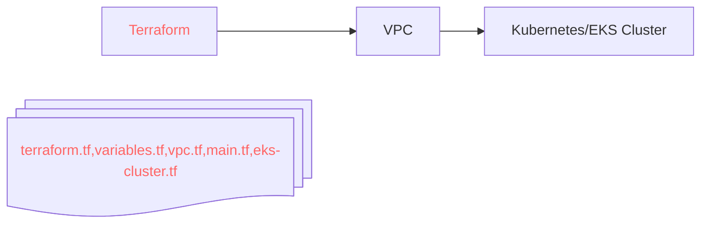

# GitOps --- Udemy
Start here
The Skinny
Background: These files should reside in the staging branch. 
Google: AWS VPC Module
Google: AWS VPC Module
Although these .tf files can be combined into one, this is how Udemy broke them down. All of these .tf files combine to utilize two modules: VPC and EKS terraform modules.

    - variables.tf (make our life easier)
        - defined region e.g. variable region { description = "AWS region" default = "us-east-2" }
        - defined clusterName e.g. variable "clusterName" { default = "vprofile-eks" }

    - terraform.tf
        - Defines all the modules that will be used/needed during this installation
            - hashicorp/aws
            - hashicorp/random (for generating some random text)
            - hashicorp/tls (for EKS cluster)
            - hashicorp/cloudinit
            - hashicorp/kubernetes
            - S3 backend

    - main.tf
        - provider aws
        - provider kubernetes
    - vpc.tf: 
        - source (module) and version of module
        - 
        - enable nat gateways to avoid extra charges
        - We need subnet tags for the EKS cluster (key/value pairs)
        - 
    - eks.tf
        - source (module) and version of module
        - vpc id of your vpc (where to put this cluster)
        - cluster name
        - cluster end point
        - node groups (basically auto-scaling group, we creating two)
        - cluster endpoint (access to kubeconfig).
            - setting cluster_endpoint_public_access=true will allow us to access it 

    - outputs.tf
        - cluster_name
        - cluster_endpoint
        - region
        - cluster_security_group_id

Make sure your S3 bucket is created in AWS and configured in terraform. If not, terraform will place it in the local directory of your machine and your team, when running terraform, will be creating infrastructure it doesn't need!

