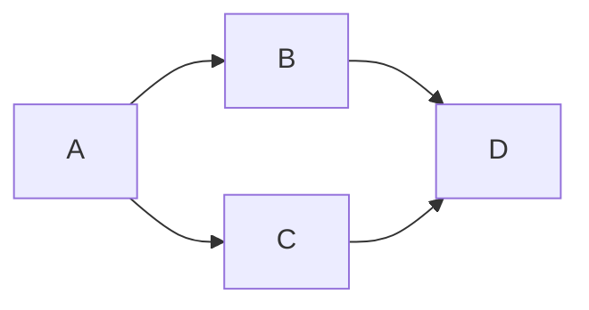

# GitOps --- Udemy
Start here
<<<<<<< HEAD

```mermaid
graph LR;
    A-->B;
    A-->C;
    B-->D;
    C-->D;
```
=======
#```mermaid
#graph LR;
#    A-->B;
#    A-->C;
#    B-->D;
#    C-->D;
#```
>>>>>>> 13c0483bf73c0ccfec8c331258e4d3840c2f91b2
