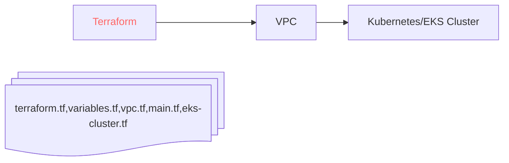

# GitOps --- Udemy
Start here

```mermaid
graph LR;
    Terra["Terraform"]
    VPC["VPC"]
    K8S["Kubernetes/EKS Cluster"]
    Terra --> VPC --> K8S

style Terra color:#f66
A@{ shape: docs, label: "terraform.tf,variables.tf,vpc.tf,main.tf,eks-cluster.tf" }
```
